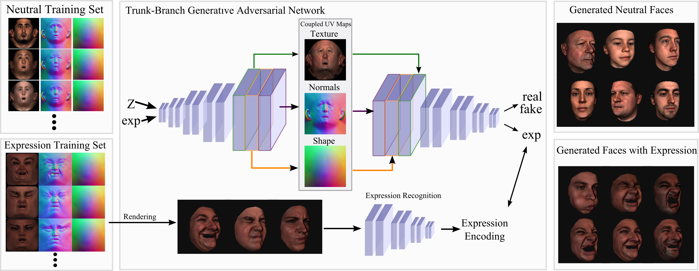

# The model is now available [HERE](https://ibug.doc.ic.ac.uk/resources/tbgan/) 
(Requires to sign End User License Agreement)


# [Synthesizing Coupled 3D Face Modalities by Trunk-Branch Generative Adversarial Networks](https://barisgecer.github.io/files/gecer_tbgan_arxiv.pdf)
[ArXiv](https://arxiv.org/pdf/1909.02215.pdf), [Supplementary Video](https://www.youtube.com/watch?v=wehBCetIb7E)

 [Baris Gecer](http://barisgecer.github.io)<sup> 1,2</sup>, [Alexander Lattas](https://alexanderlattas.com/)<sup> 1,2</sup>, [Stylianos Ploumpis](https://ibug.doc.ic.ac.uk/people/sploumpis)<sup> 1,2</sup>, [Jiankang Deng](https://jiankangdeng.github.io/)<sup> 1,2</sup>, [Athanasios Papaioannou](https://ibug.doc.ic.ac.uk/people/apapaioannou)<sup> 1,2</sup>, [Stylianos Moschoglou](https://ibug.doc.ic.ac.uk/people/smoschoglou)<sup> 1,2</sup>, & [Stefanos Zafeiriou](https://wp.doc.ic.ac.uk/szafeiri/)<sup> 1,2</sup>
 <br/>
 <sup>1 </sup>Imperial College London
 <br/>
 <sup>2 </sup>FaceSoft.io


#### This repo provides Tensorflow implementation of above paper for training

## Abstract

<p align="center"></p>


Generating realistic 3D faces is of high importance for computer graphics and computer vision applications. Generally, research on 3D face generation revolves around linear statistical models of the facial surface. Nevertheless, these models cannot represent faithfully either the facial texture or the normals of the face, which are very crucial for photo-realistic face synthesis. Recently, it was demonstrated that Generative Adversarial Networks (GANs) can be used for generating high-quality textures of faces. Nevertheless, the generation process either omits the geometry and normals, or independent processes are used to produce 3D shape information. In this paper, we present the first methodology that generates high-quality texture, shape, and normals jointly, which can be used for photo-realistic synthesis. To do so, we propose a novel GAN that can generate data from different modalities while exploiting their correlations. Furthermore, we demonstrate how we can condition the generation on the expression and create faces with various facial expressions. The qualitative results shown in this paper are compressed due to size limitations, full-resolution results and the accompanying video can be found in the supplementary documents. 

<br/>


## Supplementary Video

[<p align="center"></p>](https://www.youtube.com/watch?v=wehBCetIb7E)


## Testing the Model

- Download the model after signing the agreement and place it under '/results' directory
- Install menpo3d by
> pip install menpo3d
- And then Run the test script:
> python test.py


## Preparing datasets for training

The TBGAN code repository contains a command-line tool for recreating bit-exact replicas of the datasets that we used in the paper. The tool also provides various utilities for operating on the datasets:

```
usage: dataset_tool.py [-h] <command> ...

    display             Display images in dataset.
    extract             Extract images from dataset.
    compare             Compare two datasets.
    create_from_pkl_img_norm  Create dataset from a directory full of texture, normals and shape.

Type "dataset_tool.py <command> -h" for more information.
Please ignore other functions. The main function to prepare tf_records is 'create_from_pkl_img_norm'
```

The datasets are represented by directories containing the same image data in several resolutions to enable efficient streaming. There is a separate `*.tfrecords` file for each resolution, and if the dataset contains labels, they are stored in a separate file as well:

```
> python dataset_tool.py create_from_pkl_img_norm datasets/tf_records datasets/texture(/*.png) dataset/shape(/*.pkl) dataset/normals(/*.pkl)
```

The ```create_*``` commands take the standard version of a given dataset as input and produce the corresponding `*.tfrecords` files as output.


## Training networks
```
Please see how to start training with a PROGAN
Additionally, you will need to add 
> "dynamic_range=[-1,1],dtype = 'float32'" 
arguments to 'dataset' EasyDict() in config.py
```

Once the necessary datasets are set up, you can proceed to train your own networks. The general procedure is as follows:

1. Edit `config.py` to specify the dataset and training configuration by uncommenting/editing specific lines.
2. Run the training script with `python train.py`.
3. The results are written into a newly created subdirectory under `config.result_dir`
4. Wait several days (or weeks) for the training to converge, and analyze the results.

By default, `config.py` is configured to train a 1024x1024 network for CelebA-HQ using a single-GPU. This is expected to take about two weeks even on the highest-end NVIDIA GPUs. The key to enabling faster training is to employ multiple GPUs and/or go for a lower-resolution dataset. To this end, `config.py` contains several examples for commonly used datasets, as well as a set of "configuration presets" for multi-GPU training. All of the presets are expected to yield roughly the same image quality for CelebA-HQ, but their total training time can vary considerably:

* `preset-v1-1gpu`: Original config that was used to produce the CelebA-HQ and LSUN results shown in the paper. Expected to take about 1 month on NVIDIA Tesla V100.
* `preset-v2-1gpu`: Optimized config that converges considerably faster than the original one. Expected to take about 2 weeks on 1xV100.
* `preset-v2-2gpus`: Optimized config for 2 GPUs. Takes about 1 week on 2xV100.
* `preset-v2-4gpus`: Optimized config for 4 GPUs. Takes about 3 days on 4xV100.
* `preset-v2-8gpus`: Optimized config for 8 GPUs. Takes about 2 days on 8xV100.

For reference, the expected output of each configuration preset for CelebA-HQ can be found in [`networks/tensorflow-version/example_training_runs`](https://drive.google.com/open?id=1A9SKoQ7Xu2fqK22GHdMw8LZTh6qLvR7H)

Other noteworthy config options:

* `fp16`: Enable [FP16 mixed-precision training](http://docs.nvidia.com/deeplearning/sdk/mixed-precision-training/index.html) to reduce the training times even further. The actual speedup is heavily dependent on GPU architecture and cuDNN version, and it can be expected to increase considerably in the future.
* `BENCHMARK`: Quickly iterate through the resolutions to measure the raw training performance.
* `BENCHMARK0`: Same as `BENCHMARK`, but only use the highest resolution.
* `syn1024rgb`: Synthetic 1024x1024 dataset consisting of just black images. Useful for benchmarking.
* `VERBOSE`: Save image and network snapshots very frequently to facilitate debugging.
* `GRAPH` and `HIST`: Include additional data in the TensorBoard report.

## Analyzing results

Training results can be analyzed in several ways:

* **Manual inspection**: The training script saves a snapshot of randomly generated images at regular intervals in `fakes*.png` and reports the overall progress in `log.txt`.
* **TensorBoard**: The training script also exports various running statistics in a `*.tfevents` file that can be visualized in TensorBoard with `tensorboard --logdir <result_subdir>`.
* **Generating images and videos**: At the end of `config.py`, there are several pre-defined configs to launch utility scripts (`generate_*`). For example:
  * Suppose you have an ongoing training run titled `010-pgan-celebahq-preset-v1-1gpu-fp32`, and you want to generate a video of random interpolations for the latest snapshot.
  * Uncomment the `generate_interpolation_video` line in `config.py`, replace `run_id=10`, and run `python train.py`
  * The script will automatically locate the latest network snapshot and create a new result directory containing a single MP4 file.
* **Quality metrics**: Similar to the previous example, `config.py` also contains pre-defined configs to compute various quality metrics (Sliced Wasserstein distance, Fréchet inception distance, etc.) for an existing training run. The metrics are computed for each network snapshot in succession and stored in `metric-*.txt` in the original result directory.


## Acknowledgement
Baris Gecer is supported by the Turkish Ministry of National Education, Stylianos Ploumpis by the EPSRC Project EP/N007743/1 (FACER2VM), and Stefanos Zafeiriou by EPSRC Fellowship DEFORM (EP/S010203/1).

Code borrows heavily from NVIDIA's [PRO-GAN implementation](https://github.com/tkarras/progressive_growing_of_gans), please check and comply with its [License](https://github.com/tkarras/progressive_growing_of_gans/blob/master/LICENSE.txt). and cite their paper:
```
@inproceedings{karras2018progressive,
  title={Progressive Growing of GANs for Improved Quality, Stability, and Variation},
  author={Karras, Tero and Aila, Timo and Laine, Samuli and Lehtinen, Jaakko},
  booktitle={International Conference on Learning Representations},
  year={2018}
}
```

## Citation
If you find this work is useful for your research, please cite our [paper](https://arxiv.org/abs/1909.02215):

```
@inproceedings{gecer2020tbgan,
  title={Synthesizing Coupled 3D Face Modalities by Trunk-Branch Generative Adversarial Networks},
  author={{Gecer}, Baris and {Lattas}, Alexander and {Ploumpis}, Stylianos and
         {Deng}, Jiankang and {Papaioannou}, Athanasios and
         {Moschoglou}, Stylianos and {Zafeiriou}, Stefanos},
  booktitle={Proceedings of the European conference on computer vision (ECCV)},
  year={2020},
  organization={Springer}
  doi = {10.1007/978-3-030-58526-6_25}
}
```
